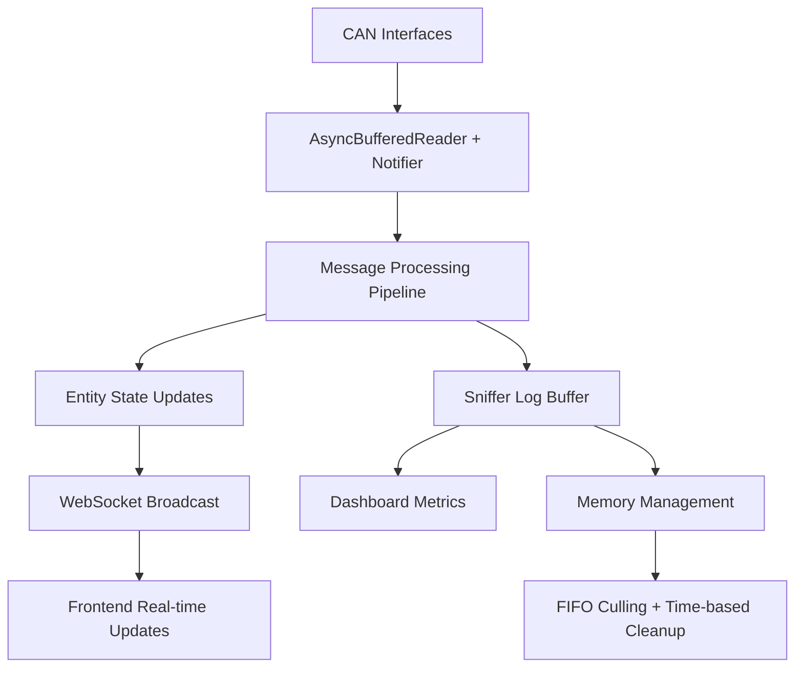

# Python Backend Instructions

## Technology Stack

- **Python 3.12+** with Poetry dependency management
- **FastAPI** for REST API and WebSocket support
- **Pydantic** for data validation and settings
- **SQLAlchemy** for database ORM (optional persistence feature)
- **pytest** for testing with asyncio support

## Architecture Patterns

### Management Services (REQUIRED)
All backend code MUST use the following management services for consistency and maintainability:

### CAN Bus Architecture (CRITICAL)
**Real-time CAN message processing with proper memory management and asyncio integration:**



#### CAN Message Reception (REQUIRED PATTERN)
```python
# CORRECT: Use python-can's asyncio integration
import can
reader = can.AsyncBufferedReader()
notifier = can.Notifier(bus, [reader], loop=asyncio.get_running_loop())
message = await reader.get_message()  # Non-blocking

# WRONG: Never use blocking calls in async context
message = bus.recv(timeout=1.0)  # BLOCKS EVENT LOOP!
```

#### CAN Data Type Handling (REQUIRED)
```python
# Handle all expected CAN message data types
if isinstance(data, str):
    data = bytes.fromhex(data)
elif isinstance(data, bytearray):  # From AsyncBufferedReader
    data = bytes(data)
elif not isinstance(data, bytes):
    logger.warning(f"Unexpected data type: {type(data)}")
    return
```

#### Memory Management for Real-time Systems (REQUIRED)
```python
# ALL buffers MUST have size limits with FIFO culling
can_command_sniffer_log.append(entry)
if len(can_command_sniffer_log) > 1000:  # Hard limit
    can_command_sniffer_log.pop(0)  # FIFO removal

# Time-based cleanup for short-lived data
pending_commands = [cmd for cmd in pending_commands
                   if time.time() - cmd["timestamp"] < 2.0]
```

#### Core Management Services
- **FeatureManager** (`backend/services/feature_manager.py`): Register and manage all features, handle dependencies
- **EntityManager** (`backend/core/entity_manager.py`): Unified entity registration, state management, device lookups
- **AppState** (`backend/core/state.py`): Core application state management, entity tracking, metrics
- **DatabaseManager** (`backend/services/database_manager.py`): Database connections, health checks, migrations
- **PersistenceService** (`backend/services/persistence_service.py`): Data persistence, backup operations
- **ConfigService** (`backend/services/config_service.py`): Configuration retrieval, validation, environment variables

#### Service Access Pattern
```python
# ALWAYS access services through dependency injection
from backend.core.dependencies import (
    get_feature_manager, get_entity_manager, get_app_state,
    get_database_manager, get_persistence_service, get_config_service
)

@router.get("/entities")
async def get_entities(
    entity_manager: EntityManager = Depends(get_entity_manager),
    app_state: AppState = Depends(get_app_state)
):
    """Use EntityManager for entity operations, AppState for runtime state."""
    entities = entity_manager.get_all_entities()
    return entities
```

#### Feature Registration Pattern
```python
# ALL features must extend Feature base class and register with FeatureManager
from backend.services.feature_base import Feature
from backend.services.feature_manager import FeatureManager

class MyFeature(Feature):
    def __init__(self, friendly_name: str = "My Feature"):
        super().__init__(friendly_name)

    async def start(self) -> None:
        """Initialize feature resources."""
        pass

    async def stop(self) -> None:
        """Cleanup feature resources."""
        pass

# Register in feature_manager.py
feature_manager = FeatureManager()
feature_manager.register_feature("my_feature", MyFeature())
```

### Service-Oriented Architecture
- **Domain Services**: Business logic in `backend/services/` (e.g., `entity_service.py`, `can_service.py`)
- **Models**: Pydantic models in `backend/models/` for data validation
- **API Routers**: FastAPI routers in `backend/api/routers/` organized by domain
- **Core Components**: Management services in `backend/core/` and `backend/services/`

### Feature Management System
- **Feature Flags**: YAML-driven configuration in `backend/services/feature_flags.yaml`
- **Feature Manager**: Centralized feature lifecycle management via `FeatureManager`
- **Feature Classes**: ALL features must extend `Feature` base class
- **Dependency Resolution**: Automatic feature dependency management
- **Environment Override**: Features can be enabled/disabled via environment variables

### Configuration Management
```python
# ALWAYS use ConfigService for configuration access
config_service: ConfigService = Depends(get_config_service)
config = await config_service.get_config_summary()

# Environment variables with COACHIQ_ prefix
COACHIQ_SERVER__HOST=0.0.0.0
COACHIQ_SERVER__PORT=8080
COACHIQ_CAN__INTERFACES=can0,can1
COACHIQ_FEATURES__ENABLE_VECTOR_SEARCH=true
```

### Domain-Specific Services (Use When Appropriate)
These services handle specific business domains and should be used via dependency injection:

- **EntityService**: RV-C entity operations, state management, light control
- **CANService**: CAN bus operations, interface monitoring, message sending
- **RVCService**: RV-C protocol-specific operations, message translation
- **DashboardService**: Dashboard data aggregation, activity feeds, bulk operations
- **WebSocketManager**: Client connection management, real-time broadcasting

```python
# Example domain service usage
from backend.core.dependencies import get_entity_service, get_can_service

@router.post("/entities/{entity_id}/command")
async def control_entity(
    entity_id: str,
    command: EntityCommand,
    entity_service: EntityService = Depends(get_entity_service),
    can_service: CANService = Depends(get_can_service)
):
    """Use EntityService for entity logic, CANService for CAN operations."""
    result = await entity_service.control_entity(entity_id, command)
    return result
```

## Performance and Optimization Patterns

### Configuration Caching
When loading expensive configuration files (JSON/YAML parsing), always use `@functools.cache` to prevent redundant I/O:

```python
import functools
from backend.integrations.rvc.decode import load_config_data

# GOOD: Cached configuration loading
@functools.cache
def load_config_data(spec_path: str | None = None, mapping_path: str | None = None):
    """Load RVC spec and mapping with automatic caching."""
    # Expensive file I/O and parsing happens only once
    pass

# Cache management
def clear_config_cache():
    """Clear cache to force reload during development."""
    load_config_data.cache_clear()
```

### CAN Interface Routing
Always resolve logical interfaces to physical interfaces for CAN message sending:

```python
# REQUIRED: Proper interface resolution for CAN messages
async def send_can_message(entity_id: str, message_data: bytes):
    entity_config = entity_manager.get_entity(entity_id).config

    # Get logical interface from entity config
    logical_interface = entity_config.get("interface", "house")  # "house" or "chassis"

    # Resolve to physical interface using mappings
    can_settings = get_can_settings()
    physical_interface = can_settings.interface_mappings.get(logical_interface)

    if not physical_interface:
        logger.warning(f"No mapping for '{logical_interface}', using fallback")
        physical_interface = can_settings.all_interfaces[0]

    # Send to specific interface (not all interfaces)
    await can_tx_queue.put((can_message, physical_interface))
```

### Startup Optimization
Avoid duplicate service initialization by ensuring clear separation between features and services:

```python
# GOOD: Features handle complex initialization, services provide business logic
class CANFeature(Feature):
    async def startup(self):
        # Initialize CAN interfaces through CANService
        can_service = CANService()
        await can_service.startup()  # Handles interfaces + writer task

# AVOID: Don't initialize the same service in multiple places
# main.py should NOT call can_service.startup() if feature already does it
```

## CAN System Troubleshooting Guide

### Common Issues and Solutions

#### "No CAN Activity" Alert on Dashboard
- **Cause**: Message rate calculation returning 0
- **Check**: Backend logs for "CAN listener started for interface: canX"
- **Verify**: `candump can1` shows actual traffic exists
- **Fix**: Ensure `_calculate_message_rate()` in CAN service is working
- **Config**: Check `COACHIQ_CAN__INTERFACES` includes all active interfaces

#### CAN Listener Startup Hanging
- **Cause**: Blocking `bus.recv()` calls in async context
- **Solution**: Use `AsyncBufferedReader` + `Notifier` pattern
- **Check**: Startup logs should show all interfaces starting quickly
- **Error Pattern**: "Unexpected data type: <class 'bytearray'>" floods logs

#### WebSocket Connection Issues
- **Health Endpoint**: Frontend should call `/healthz` NOT `/api/healthz`
- **Real-time Data**: Use WebSocket for CAN messages, not REST polling
- **Connection Check**: Browser dev tools → Network → WS connections
- **Fallback**: Implement REST polling fallback for WebSocket failures

#### Memory Growth in Long-running Systems
- **Buffers**: All CAN buffers MUST have size limits (1000 sniffer, 500 grouped)
- **Cleanup**: Implement time-based cleanup for pending commands (2s)
- **Monitoring**: Check entity history growth with entity count
- **Pattern**: Use FIFO culling + time-based expiration

#### Message Processing Pipeline Issues
- **Data Types**: Handle `str`, `bytearray`, and `bytes` in CAN processing
- **Entity Updates**: Verify decoded CAN → entity state → WebSocket broadcast
- **Correlation**: Check command/response correlation for UI feedback
- **Timeout**: Frontend 2-second timeout requires proper WebSocket updates

#### Interface Configuration Problems
- **Physical vs Logical**: Map logical ("house") to physical ("can0") interfaces
- **Multiple Interfaces**: Verify both `can0` and `can1` are configured
- **Startup Order**: CAN service → interfaces → listeners → message processing
- **Error Recovery**: Implement interface reconnection on failures

### Debugging Commands
```bash
# Check actual CAN traffic exists
candump can1

# Verify interface configuration
COACHIQ_CAN__INTERFACES="can0,can1"

# Monitor memory usage
poetry run python -c "import psutil; print(f'Memory: {psutil.Process().memory_info().rss / 1024 / 1024:.1f}MB')"

# Check WebSocket connections
# Browser Dev Tools → Network → WS connections should show active streams
```

## Code Quality Requirements

### Formatting and Linting
```bash
# Required before all commits
poetry run ruff format backend
poetry run ruff check .
poetry run pyright backend
```

### Standards
- **Line Length**: 100 characters
- **Import Order**: stdlib → third-party → local (absolute imports only)
- **Type Hints**: Required for all function parameters and return values
- **Docstrings**: Required for public APIs using Google-style format

### Linting Exceptions
Some FastAPI patterns require linting exceptions:

```python
# FastAPI dependency injection (B008 exception is correct)
@router.get("/entities")
async def get_entities(
    entity_service: EntityService = Depends(get_entity_service),  # noqa: B008
):
    """Depends() in argument defaults is the official FastAPI pattern."""
    pass

# Type annotations (UP007, UP038 should be applied automatically)
def example(value: str | None = None) -> list[dict]:  # Use | instead of Union
    if isinstance(value, str | int):  # Use | in isinstance calls
        return [{"result": value}]
```

### Type Checking
- **Tool**: Pyright in basic mode
- **Custom Stubs**: Create in `typings/` for third-party libraries without type hints
- **Pattern**: Use Protocol-based implementations for complex interfaces

## API Development Patterns

### Entity Control Commands
```python
# Standard entity control command structure
{
    "command": "set",       # Required: set, toggle, brightness_up, brightness_down
    "state": "on",         # Optional: on, off
    "brightness": 75       # Optional: 0-100
}
```

### FastAPI Route Structure
```python
from fastapi import APIRouter, Depends
from backend.core.dependencies import get_entity_service
from backend.models.entity import EntityResponse

router = APIRouter(prefix="/api/entities", tags=["entities"])

@router.get("/{entity_id}", response_model=EntityResponse)
async def get_entity(
    entity_id: str,
    entity_service: EntityService = Depends(get_entity_service)
) -> EntityResponse:
    """Get entity by ID with comprehensive documentation."""
    return await entity_service.get_entity(entity_id)
```

### WebSocket Patterns
```python
from fastapi import WebSocket
from backend.websocket.handlers import ConnectionManager

manager = ConnectionManager()

@app.websocket("/ws/entities")
async def websocket_endpoint(websocket: WebSocket):
    await manager.connect(websocket)
    try:
        while True:
            data = await websocket.receive_text()
            await manager.broadcast(data)
    except WebSocketDisconnect:
        manager.disconnect(websocket)
```

## Integration Patterns

### CAN Bus Integration
**REQUIRED**: Always use CANService and CANInterfaceService for CAN operations:
```python
# Use services, not direct integration access
can_service: CANService = Depends(get_can_service)
can_interface_service: CANInterfaceService = Depends(get_can_interface_service)

# Get CAN status through service
status = await can_service.get_status()
# Resolve interfaces through service
interface = can_interface_service.resolve_interface("logical_name")
```
- **Manager**: `backend/integrations/can/manager.py` (accessed via CANService)
- **Message Factory**: `backend/integrations/can/message_factory.py` (used by services)
- **Auto-reconnection**: Built-in retry logic for interface failures

### RV-C Protocol
**REQUIRED**: Always use RVCService for RV-C operations:
```python
# Use RVCService for protocol operations
rvc_service: RVCService = Depends(get_rvc_service)
await rvc_service.start()  # Proper lifecycle management
```
- **Decoder**: `backend/integrations/rvc/decode.py` (accessed via RVCService)
- **Feature Integration**: `backend/integrations/rvc/feature.py` (registered with FeatureManager)
- **Configuration**: Uses `config/rvc.json` for protocol specifications (via ConfigService)

## Testing Patterns

### pytest Configuration
```python
# Use pytest with asyncio support
import pytest
from backend.core.config import get_settings

@pytest.fixture
async def mock_can_interface():
    """Mock CAN interface for testing."""
    # Implementation

@pytest.mark.asyncio
async def test_entity_control(mock_can_interface):
    """Test entity control with mocked CAN interface."""
    # Test implementation
```

### Test Structure
- **Location**: `tests/` directory with domain-based organization
- **Factories**: Use `tests/factories.py` for test data creation
- **Mocking**: Mock CAN interfaces and external dependencies
- **Coverage**: Aim for >80% coverage on business logic

## MCP Tools for Backend Development

**IMPORTANT**: Always default to `@context7` for any library or framework questions before falling back to other tools. This ensures you get current, correct API information rather than outdated or hallucinated answers.

### Priority Order for Research:
1. **@context7**: For library/framework questions (FastAPI, React, TypeScript, Python libraries)
2. **@perplexity**: For general concepts, protocols, best practices, and research not found in codebase
3. **@github**: For repository exploration, issue research, and project history

### When to Use @context7 (FIRST CHOICE)
- **Framework Questions**: `@context7 FastAPI dependency injection patterns`
- **Library APIs**: `@context7 Pydantic model with nested validation`
- **Language Features**: `@context7 Python Protocol implementation`
- **Implementation Patterns**: `@context7 FastAPI WebSocket broadcast patterns`
- **Code Examples**: `@context7 SQLAlchemy async session management`

### When to Use @perplexity (SECOND CHOICE)
Use Perplexity for conceptual questions, best practices, and domain knowledge not available in library docs:

- **Best Practices**: `@perplexity FastAPI dependency injection best practices for large applications`
- **Protocol Standards**: `@perplexity CAN bus protocol message routing best practices`
- **Architecture Decisions**: `@perplexity Python async task lifecycle management patterns`
- **Performance Optimization**: `@perplexity Python configuration file caching strategies`
- **Design Patterns**: `@perplexity Service-oriented architecture patterns in Python`
- **Framework Comparisons**: `@perplexity SQLAlchemy vs raw SQL performance considerations`

### When to Use @github (THIRD CHOICE)
- **Repository Research**: `@github search repositories for FastAPI CAN bus integration`
- **Issue Investigation**: `@github search issues related to WebSocket reconnection patterns`
- **Project History**: `@github list commits related to entity management refactoring`
- **Code Discovery**: `@github search code for dependency injection patterns`

### Project Context Queries
- **Find Implementations**: `@context7 entity service implementation patterns`
- **Check Patterns**: `@context7 CAN message processing patterns`
- **Review Configuration**: `@context7 feature flag configuration examples`
- **API Documentation**: `@context7 FastAPI router configuration patterns`

### Example Research Workflow
```bash
# 1. Start with @context7 for framework-specific questions
@context7 FastAPI background tasks with dependency injection

# 2. Use @perplexity for concepts and best practices
@perplexity background task lifecycle management best practices Python

# 3. Use @github for related implementations
@github search code for FastAPI background task patterns
```

## Common Development Tasks

### Adding New Features
1. Define feature in `backend/services/feature_flags.yaml`
2. Create feature class inheriting from `FeatureBase` in `backend/services/`
3. Register feature in `backend/services/feature_manager.py`
4. Add feature dependencies if needed
5. Implement feature-specific services and models

### Adding API Endpoints
1. Create router in `backend/api/routers/`
2. Define Pydantic models in `backend/models/`
3. Implement service logic in `backend/services/`
4. Add comprehensive docstrings for OpenAPI generation
5. Write tests in corresponding `tests/` subdirectory
6. Update router configuration in `backend/api/router_config.py`

### Database Integration (Optional Persistence Feature)
**REQUIRED**: Always use DatabaseManager and PersistenceService for database operations:
```python
# Enable persistence feature via environment variable
COACHIQ_FEATURES__ENABLE_PERSISTENCE=true

# Use DatabaseManager for connections
database_manager: DatabaseManager = Depends(get_database_manager)
session = await database_manager.get_session()

# Use PersistenceService for data operations
persistence_service: PersistenceService = Depends(get_persistence_service)
backup_result = await persistence_service.backup_database()

# Use repositories with proper dependency injection
from backend.services.repositories import EntityRepository, ConfigRepository

async def get_entities(db_manager: DatabaseManager = Depends(get_database_manager)):
    repo = EntityRepository(db_manager)
    return await repo.get_all()
```

## Nix Flake (Optional)

### Nix Development Environment
The project includes an optional Nix flake (`flake.nix`) that provides:
- **Reproducible development environment** with all Python dependencies
- **CLI apps** accessible via `nix run`:
  - `nix run .#test` - Run unit tests
  - `nix run .#lint` - Run linters (ruff, pyright)
  - `nix run .#format` - Format code
  - `nix run .#ci` - Full CI suite
  - `nix run .#build-frontend` - Build frontend
- **NixOS module** for production deployment
- **Automatic frontend setup** when entering nix shell

**Note**: Nix is optional. All commands work with standard Poetry and npm tooling.

## Environment Configuration

### Configuration Pattern
All environment variables follow the `COACHIQ_` prefix pattern:
```bash
# Top-level settings
COACHIQ_APP_NAME=CoachIQ
COACHIQ_ENVIRONMENT=development

# Nested settings (double underscore for nesting)
COACHIQ_SERVER__HOST=127.0.0.1
COACHIQ_SERVER__PORT=8000
COACHIQ_CAN__INTERFACES=virtual0
COACHIQ_FEATURES__ENABLE_PERSISTENCE=true
```

### Key Configuration Sections
1. **Server Configuration**: `COACHIQ_SERVER__*`
2. **CAN Bus Settings**: `COACHIQ_CAN__*`
3. **Feature Flags**: `COACHIQ_FEATURES__*`
4. **Persistence**: `COACHIQ_PERSISTENCE__*`
5. **Database**: `COACHIQ_DATABASE__*`
6. **Security**: `COACHIQ_SECURITY__*`
7. **Logging**: `COACHIQ_LOGGING__*`

### Persistence Modes
```bash
# 1. Memory-only (default - no persistence)
COACHIQ_PERSISTENCE__ENABLED=false

# 2. Development (local file storage)
COACHIQ_PERSISTENCE__ENABLED=true
COACHIQ_PERSISTENCE__DATA_DIR=backend/data

# 3. Production (system directory)
COACHIQ_PERSISTENCE__ENABLED=true
COACHIQ_PERSISTENCE__DATA_DIR=/var/lib/coachiq
```

### Configuration Loading Order
1. Default values in Pydantic Settings classes
2. Values from `.env` file
3. Environment variables (override everything)

**IMPORTANT**: Always use ConfigService to access configuration:
```python
config_service: ConfigService = Depends(get_config_service)
config = await config_service.get_config_summary()
```

## Critical Requirements

### Management Service Usage (MANDATORY)
- **ALWAYS use FeatureManager for feature registration**: Never directly instantiate features
- **ALWAYS use EntityManager for entity operations**: Never access entities directly from AppState
- **ALWAYS use ConfigService for configuration**: Never access settings directly
- **ALWAYS use DatabaseManager for database operations**: Never create direct SQLAlchemy sessions
- **ALWAYS use dependency injection**: Access services via `backend.core.dependencies`

### Development Standards
- **All Python commands MUST use Poetry**: `poetry run python script.py`
- **Use absolute imports only**: `from backend.services.entity_service import EntityService`
- **All API endpoints use `/api/entities`**: Never create separate endpoint patterns like `/api/lights`
- **Comprehensive API documentation**: Include examples, descriptions, and response schemas

### Service Dependency Examples
```python
# CORRECT: Use dependency injection
@router.get("/status")
async def get_status(
    feature_manager: FeatureManager = Depends(get_feature_manager),
    entity_manager: EntityManager = Depends(get_entity_manager)
):
    features = feature_manager.get_enabled_features()
    entities = entity_manager.get_all_entities()
    return {"features": features, "entities": entities}

# WRONG: Direct service access
from backend.services.feature_manager import feature_manager  # DON'T DO THIS
```
