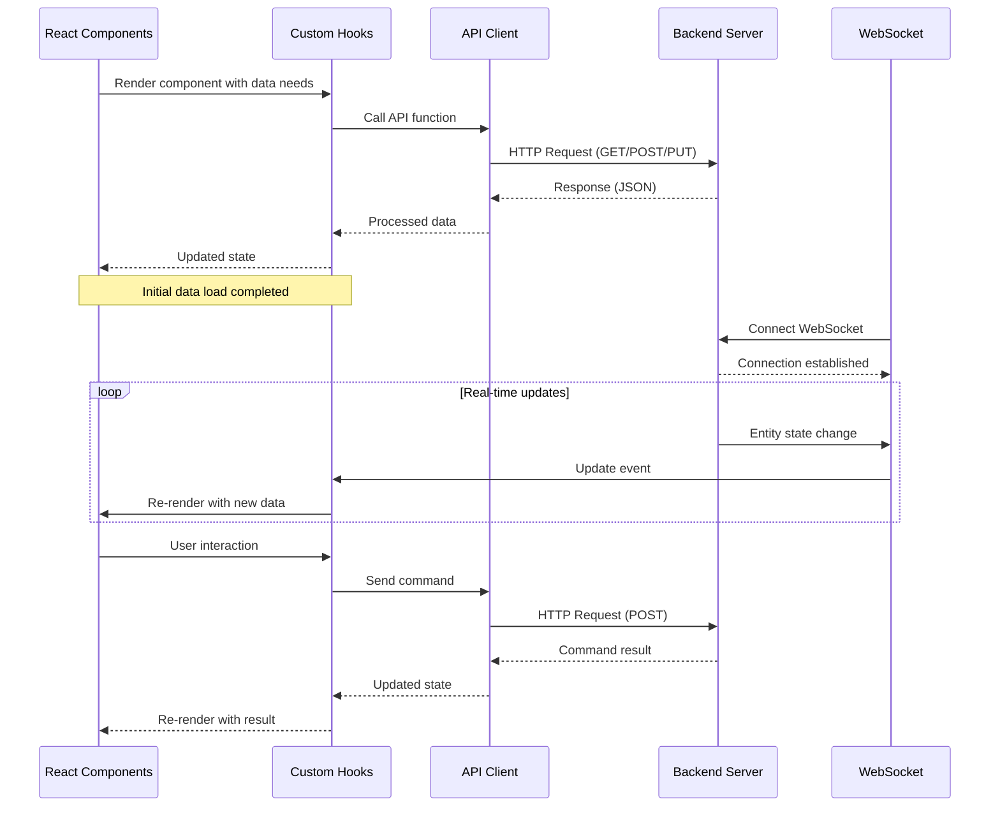

# Frontend API Integration

This page describes how the React frontend integrates with the rvc2api backend API.

## Integration Architecture



## API Client Structure

The frontend uses a structured approach for API communication:

1. **API Types** (`src/api/types.ts`): TypeScript interfaces matching the API response models
2. **API Endpoints** (`src/api/endpoints.ts`): Functions to call specific API endpoints
3. **API Utilities** (`src/api/index.ts`): Helper functions for error handling and response parsing

## Base API Configuration

The API base URL and common fetch options are defined in `endpoints.ts`:

```typescript
/** Base URL for API requests */
const API_BASE = "/api";

// Common fetch options
const defaultOptions: RequestInit = {
  headers: {
    "Content-Type": "application/json",
  },
};
```

## Entity API Integration

### Fetching Entities

Entities are fetched using the standardized `/api/entities` endpoint:

```typescript
export async function fetchLights(): Promise<LightStatus[]> {
  const response = await fetch(
    `${API_BASE}/entities?device_type=light`,
    defaultOptions
  );
  return handleApiResponse<LightStatus[]>(response);
}
```

### Controlling Entities

Entity control commands follow the standardized command format:

```typescript
export async function setLightState(
  id: string,
  state: boolean
): Promise<LightControlResponse> {
  const command = {
    command: "set",
    state: state ? "on" : "off",
  };

  const response = await fetch(`${API_BASE}/entities/${id}/control`, {
    ...defaultOptions,
    method: "POST",
    body: JSON.stringify(command),
  });

  return handleApiResponse<LightControlResponse>(response);
}
```

### Setting Brightness

```typescript
export async function setLightBrightness(
  id: string,
  brightness: number
): Promise<LightControlResponse> {
  const command = {
    command: "set",
    state: "on",
    brightness: Math.min(Math.max(0, Math.round(brightness)), 100),
  };

  const response = await fetch(`${API_BASE}/entities/${id}/control`, {
    ...defaultOptions,
    method: "POST",
    body: JSON.stringify(command),
  });

  return handleApiResponse<LightControlResponse>(response);
}
```

## WebSocket Integration

The frontend connects to the WebSocket API for real-time updates:

```typescript
export function setupWebSocket(
  onMessage: (data: any) => void,
  onConnect: () => void,
  onDisconnect: () => void
): WebSocket {
  const wsProtocol = window.location.protocol === "https:" ? "wss:" : "ws:";
  const wsUrl = `${wsProtocol}//${window.location.host}/api/ws`;

  const socket = new WebSocket(wsUrl);

  socket.onopen = () => {
    console.log("WebSocket connected");
    onConnect();
  };

  socket.onmessage = (event) => {
    try {
      const data = JSON.parse(event.data);
      onMessage(data);
    } catch (error) {
      console.error("Error parsing WebSocket message:", error);
    }
  };

  socket.onclose = () => {
    console.log("WebSocket disconnected");
    onDisconnect();
  };

  return socket;
}
```

## Error Handling

The frontend uses a consistent error handling approach for API responses:

```typescript
export async function handleApiResponse<T>(response: Response): Promise<T> {
  if (!response.ok) {
    let errorMessage = `API Error: ${response.status}`;
    try {
      const errorData = await response.json();
      errorMessage = errorData.detail || errorMessage;
    } catch (e) {
      // Use default error message if we can't parse the response
    }
    throw new Error(errorMessage);
  }

  return response.json() as Promise<T>;
}
```

## Type Safety

The frontend uses TypeScript interfaces to ensure type safety when working with API responses:

```typescript
// Example entity interface
interface Entity {
  id: string;
  name: string;
  device_type: string;
  suggested_area: string;
  state: string;
  raw: Record<string, any>;
  capabilities: string[];
  last_updated: string;
}

// Light-specific interface
interface LightStatus extends Entity {
  brightness?: number;
}
```

This ensures that API data is properly validated at compile-time.
