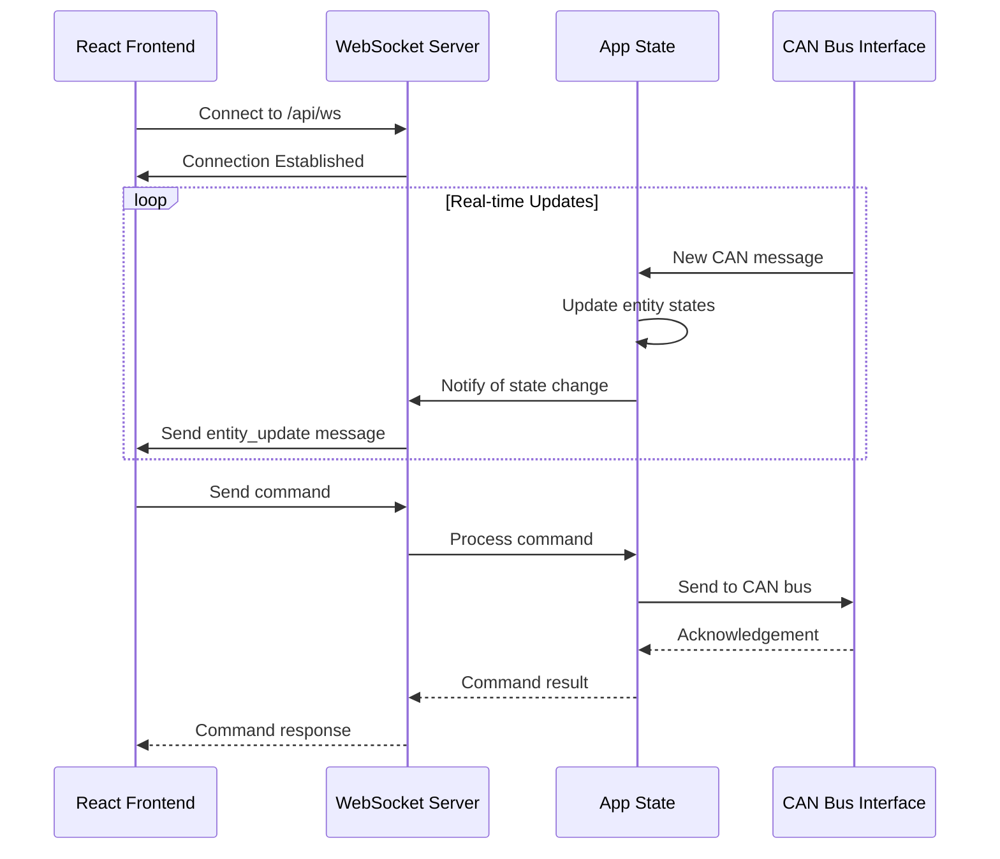

# WebSocket API Reference

The WebSocket API allows you to receive real-time updates about entity state changes and system events.

## WebSocket Communication Flow

The following diagram illustrates how WebSocket communication flows through the system:



## Connection

Connect to the WebSocket endpoint at:

```text
ws://[server-address]/api/ws
```

## Message Format

### Entity Updates

When an entity's state changes, a message with the following format is sent:

```json
{
  "type": "entity_update",
  "data": {
    "id": "light_1",
    "name": "Living Room Light",
    "device_type": "light",
    "suggested_area": "living_room",
    "state": "on",
    "raw": {
      "operating_status": 100
    },
    "capabilities": ["toggle", "brightness"],
    "last_updated": "2023-05-18T15:30:45",
    "source_type": "rv-c"
  }
}
```

### CAN Bus Messages

When a CAN message is received, it is broadcasted to WebSocket clients:

```json
{
  "type": "can_message",
  "data": {
    "timestamp": "2023-05-18T15:30:45",
    "arbitration_id": "18FEF121",
    "data": "FFFF0000FFFF0000",
    "decoded": {
      "dgn": "FEF1",
      "name": "DC Dimmer Command"
    }
  }
}
```

### Log Messages

Log messages from the server are also sent via WebSocket:

```json
{
  "type": "log",
  "level": "info",
  "message": "Light state changed: light_1 turned on"
}
```

## Usage in JavaScript

Here's an example of how to connect to and use the WebSocket API from JavaScript:

```javascript
// Connect to the WebSocket
const socket = new WebSocket(`ws://${window.location.host}/api/ws`);

// Handle connection open
socket.onopen = () => {
  console.log("WebSocket connection established");
};

// Handle incoming messages
socket.onmessage = (event) => {
  const data = JSON.parse(event.data);

  switch (data.type) {
    case "entity_update":
      console.log("Entity update received:", data.data);
      // Update UI with new entity state
      break;

    case "can_message":
      console.log("CAN message received:", data.data);
      // Process CAN message if needed
      break;

    case "log":
      console.log(`Server log [${data.level}]: ${data.message}`);
      // Display log message if needed
      break;

    default:
      console.log("Unknown message type:", data);
  }
};

// Handle errors
socket.onerror = (error) => {
  console.error("WebSocket error:", error);
};

// Handle connection close
socket.onclose = (event) => {
  console.log("WebSocket connection closed:", event.code, event.reason);
  // Reconnect logic could go here
};
```
