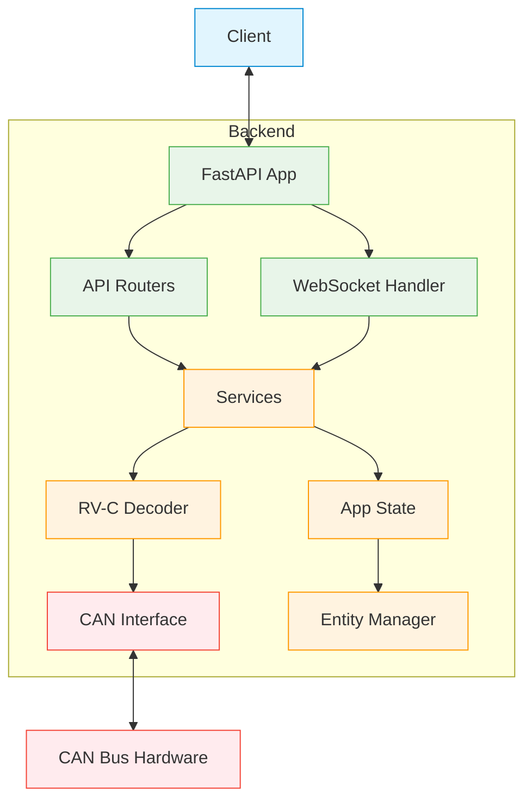

# Backend Architecture

This page provides an overview of the CoachIQ backend architecture, focusing on how the API components are structured.

## Core Components

### Component Structure

The backend consists of several key components:

```text
backend/                  # Main backend application
├── api/                  # API layer
│   ├── routers/          # FastAPI route handlers
│   ├── dependencies.py   # Dependency injection functions
│   └── router_config.py  # Router configuration
├── core/                 # Core utilities
│   ├── config.py         # Application configuration
│   ├── state.py          # Application state management
│   ├── logging_config.py # Logging configuration
│   ├── metrics.py        # Prometheus metrics
│   └── version.py        # Version information
├── services/             # Business logic services
│   ├── feature_manager.py # Feature flag management
│   ├── config_service.py  # Configuration service
│   └── entity_service.py  # Entity management service
├── integrations/         # External integrations
│   ├── can/              # CAN bus integration
│   └── rvc/              # RV-C protocol integration
├── websocket/            # WebSocket handlers
│   └── handlers.py       # WebSocket endpoint handlers
├── models/               # Data models
│   ├── entities.py       # Entity data models
│   └── responses.py      # API response models
├── middleware/           # HTTP middleware
│   └── http.py           # Request/response middleware
└── main.py               # Application entry point
src/
├── common/               # Shared models and utilities
└── rvc_decoder/          # RV-C protocol decoder
```

### Component Flow



## API Architecture

### FastAPI Application

The main FastAPI application is created in `main.py`. It configures:

- API metadata and documentation settings
- Middleware for metrics and logging
- API routers for different functional areas
- WebSocket connections for real-time updates
- Startup and shutdown event handlers

### API Routers

API routes are organized by functional area in separate modules:

- `api_routers/entities.py`: Entity management and control
- `api_routers/can.py`: CAN bus interaction
- `api_routers/config_and_ws.py`: Configuration and WebSocket endpoints
- `api_routers/docs.py`: Documentation-related endpoints

Each router file contains route handlers for a specific area of functionality, keeping the codebase modular and maintainable.

### Data Models

Data models are defined using Pydantic, ensuring:

- Schema validation for request and response data
- Automatic documentation generation
- Type safety throughout the application

Key models include:

- `Entity`: Represents a device in the RV (light, tank, etc.)
- `ControlCommand`: Standardized command format for controlling entities
- `ControlEntityResponse`: Response format for control operations

### State Management

The application maintains shared state in `app_state.py`:

- Current entity states
- Entity history
- Entity mappings (DGN to entity ID)
- CAN bus configuration

This centralized state management allows different components to access the same data without tight coupling.

## Real-time Communication

The application provides real-time updates through WebSockets:

- Entity state changes
- CAN bus messages
- System log events

WebSocket connections are managed in `websocket.py`, which handles:

- Client connection management
- Message broadcasting
- Connection authentication (when enabled)

## CAN Bus Integration

The application integrates with the RV-C CAN bus through:

- `can_manager.py`: Handles CAN bus connections and message processing
- `rvc_decoder/`: Decodes raw CAN messages into structured data

When a message is received from the CAN bus:

1. It's decoded using the RV-C specification
2. The decoded data updates entity state in `app_state.py`
3. The updated entity is broadcast to WebSocket clients
4. The entity state history is updated

## Future Architecture

The planned future architecture will reorganize the codebase into:

```
backend/
├── api/               # API routes and controllers
├── integrations/      # External system integrations
│   └── rvc/           # RV-C specific code
├── middleware/        # HTTP and WebSocket middleware
├── models/            # Application data models
├── services/          # Business logic services
└── settings/          # Configuration handling
```

This reorganization will:

- Improve separation of concerns
- Make the codebase more maintainable
- Prepare for additional integrations beyond RV-C
