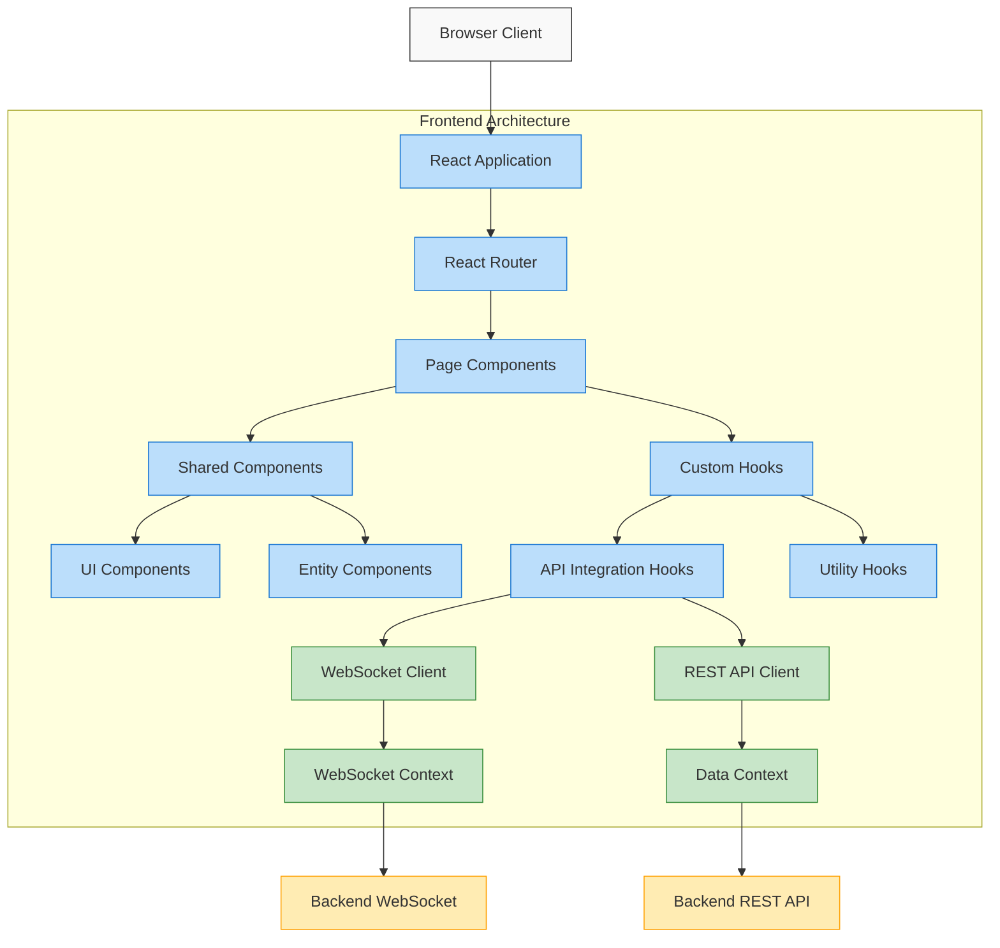

# Frontend Architecture

This page provides an overview of the CoachIQ frontend architecture, focusing on how it integrates with the API.

## Architecture Overview



## Core Components

The frontend is built using React, TypeScript, and Vite, with the following structure:

```
frontend/
├── public/            # Static assets
├── src/
│   ├── api/           # API integration
│   ├── components/    # React components
│   ├── context/       # React context providers
│   ├── hooks/         # Custom React hooks
│   ├── pages/         # Page components
│   ├── store/         # State management
│   ├── styles/        # CSS and styling
│   └── utils/         # Utility functions
└── docs/              # Frontend-specific documentation
```

## API Integration

### API Module Structure

The API integration is organized in the `src/api` directory:

```
src/api/
├── index.ts          # Main API exports & utilities
├── endpoints.ts      # API endpoint functions
└── types.ts          # TypeScript interfaces for API models
```

This structure separates concerns and allows for better type safety and maintainability.

### API Endpoints

API endpoints are defined in `endpoints.ts` as functions that:

1. Construct the appropriate URL
2. Set up request options
3. Make the fetch request
4. Handle errors and parse responses

Example:

```typescript
export async function fetchLights(): Promise<LightStatus[]> {
  const response = await fetch(
    `${API_BASE}/entities?device_type=light`,
    defaultOptions
  );
  return handleApiResponse<LightStatus[]>(response);
}
```

### API Types

API types in `types.ts` define the structure of request and response data using TypeScript interfaces:

```typescript
export interface Entity {
  id: string;
  name: string;
  device_type: string;
  suggested_area: string;
  state: string;
  raw: Record<string, any>;
  capabilities: string[];
  last_updated: string;
}

export interface LightStatus extends Entity {
  brightness?: number;
}
```

## State Management

The frontend uses React's Context API for state management, with custom hooks to interact with the API:

```typescript
// Example of a custom hook for lights
export function useLights() {
  const [lights, setLights] = useState<LightStatus[]>([]);
  const [loading, setLoading] = useState(true);
  const [error, setError] = useState<Error | null>(null);

  useEffect(() => {
    async function loadLights() {
      try {
        setLoading(true);
        const data = await fetchLights();
        setLights(data);
        setError(null);
      } catch (err) {
        setError(err as Error);
      } finally {
        setLoading(false);
      }
    }

    loadLights();
  }, []);

  return { lights, loading, error };
}
```

## WebSocket Integration

The frontend connects to the WebSocket API for real-time updates through a custom hook:

```typescript
export function useWebSocket() {
  const [isConnected, setIsConnected] = useState(false);
  const [lastMessage, setLastMessage] = useState<any>(null);
  const socketRef = useRef<WebSocket | null>(null);

  useEffect(() => {
    const wsProtocol = window.location.protocol === "https:" ? "wss:" : "ws:";
    const wsUrl = `${wsProtocol}//${window.location.host}/api/ws`;

    const socket = new WebSocket(wsUrl);
    socketRef.current = socket;

    socket.onopen = () => {
      setIsConnected(true);
    };

    socket.onmessage = (event) => {
      try {
        const data = JSON.parse(event.data);
        setLastMessage(data);
      } catch (e) {
        console.error("Failed to parse WebSocket message:", e);
      }
    };

    socket.onclose = () => {
      setIsConnected(false);
    };

    return () => {
      socket.close();
    };
  }, []);

  return { isConnected, lastMessage };
}
```

## Component Structure

Components are organized by feature, with each feature typically including:

- A container component that handles API calls and state
- Presentational components that render UI based on props
- Custom hooks for logic reuse

## TypeScript Integration

TypeScript is used throughout the application to ensure type safety, with:

- API types matching backend models
- Props interfaces for components
- Strong typing for hooks and utility functions
