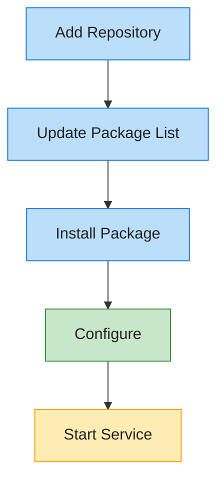

# Debian Repository

This page provides instructions for using the rvc2api Debian package repository.

## Repository Structure

The Debian repository is hosted on GitHub Pages alongside this documentation. The repository follows standard Debian repository structure:

```
debian-repo/
├── dists/
│   └── stable/
│       ├── main/
│       │   ├── binary-amd64/
│       │   │   ├── Packages
│       │   │   └── Packages.gz
│       │   └── binary-arm64/
│       │       ├── Packages
│       │       └── Packages.gz
│       └── Release
└── pool/
    └── main/
        └── r/
            └── rvc2api/
                └── *.deb
```

## Adding the Repository

To add the repository to your Debian or Ubuntu system, follow these steps:

```bash
# Add the repository GPG key
curl -fsSL https://username.github.io/rvc2api/debian-repo/KEY.gpg | sudo apt-key add -

# Add the repository to your sources list
echo "deb https://username.github.io/rvc2api/debian-repo stable main" | sudo tee /etc/apt/sources.list.d/rvc2api.list

# Update package lists
sudo apt update
```

Replace `username` with the GitHub username or organization hosting the repository.

## Installing Packages

Once the repository is added, you can install packages with:

```bash
sudo apt install rvc2api
```

## Available Packages

| Package Name | Description                    | Architecture |
| ------------ | ------------------------------ | ------------ |
| rvc2api      | RV-C API and WebSocket service | amd64, arm64 |

## Version History

| Version | Release Date | Changes         |
| ------- | ------------ | --------------- |
| 0.1.0   | TBD          | Initial release |

## Building From Source

If you prefer to build the package from source, refer to the [Development Environment](development-environments.md) documentation.


