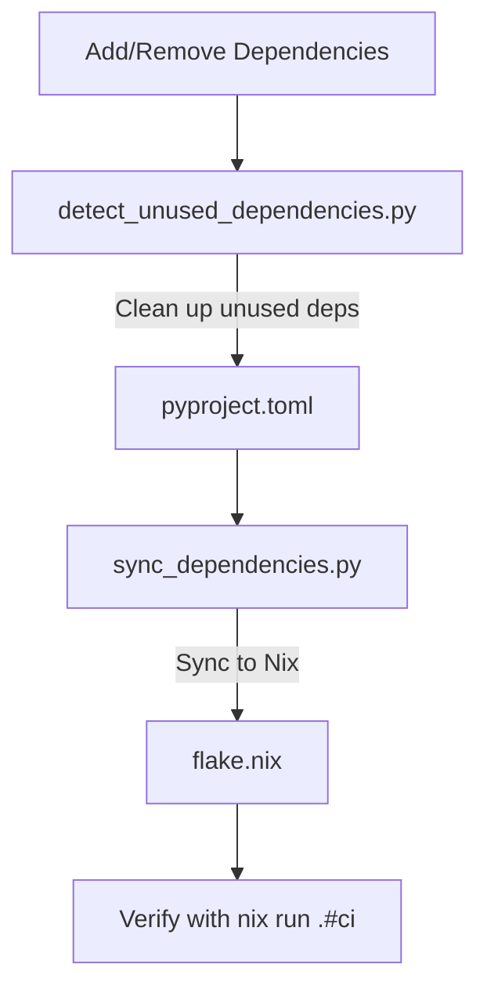

# Dependency Management Scripts

This document describes the dependency management scripts used in the rvc2api project to maintain clean, consistent, and synchronized dependencies across different configuration files.

## Overview

The rvc2api project uses two main scripts for dependency management:

1. `detect_unused_dependencies.py` - Identifies and optionally removes unused Python dependencies
2. `sync_dependencies.py` - Ensures dependencies are synchronized between `pyproject.toml` and `flake.nix`

These scripts help maintain a clean dependency tree and ensure consistent build behavior across development and CI environments.

### How the Scripts Work Together

The two scripts address different but complementary aspects of dependency management:

1. **detect_unused_dependencies.py** focuses on keeping `pyproject.toml` clean by removing unused dependencies.
2. **sync_dependencies.py** ensures that whatever is in `pyproject.toml` is properly reflected in `flake.nix`.

This creates a complete dependency management workflow:



Using both scripts together provides a robust approach to dependency management that works across different package management systems.

## detect_unused_dependencies.py

### Purpose

The `detect_unused_dependencies.py` script helps you identify and remove unused Python dependencies from your project. It uses [deptry](https://github.com/fpgmaas/deptry), a sophisticated dependency analyzer, to scan your codebase and detect packages that are declared in `pyproject.toml` but not actually imported or used in your code.

Benefits:
- Reduces project bloat
- Minimizes potential security vulnerabilities from unnecessary dependencies
- Speeds up installation and CI processes
- Keeps dependency declarations accurate and up-to-date

### Usage

```bash
# Within the Nix development shell
poetry run python scripts/detect_unused_dependencies.py [options]
```

#### Options

- `--fix` - Automatically remove unused dependencies from pyproject.toml
- `--check` - Exit with error code if unused dependencies are found (useful for CI)
- `--dry-run` - Show what would be changed without modifying files
- `--pyproject PATH` - Specify custom path to pyproject.toml (default: pyproject.toml in current directory)
- `--verbose` - Enable verbose debug output

### Examples

```bash
# Show unused dependencies
poetry run python scripts/detect_unused_dependencies.py

# Remove unused dependencies automatically
poetry run python scripts/detect_unused_dependencies.py --fix

# CI check mode (fails if unused dependencies exist)
poetry run python scripts/detect_unused_dependencies.py --check

# Preview what would be removed
poetry run python scripts/detect_unused_dependencies.py --dry-run
```

### How It Works

1. Reads dependencies from `pyproject.toml`
2. Runs `deptry` to analyze the codebase and detect unused packages
3. Filters out known false positives (like implicit dependencies)
4. Reports unused dependencies or removes them based on options

### Configuration

The script includes an `IGNORE_PACKAGES` list that prevents certain packages from being reported as unused. This is useful for dependencies that are used implicitly (not via direct imports) or are required for specific runtime behaviors:

```python
IGNORE_PACKAGES: ClassVar[set[str]] = {
    # Common false positives or packages that are used implicitly
    "uvicorn",
    "websockets",
    "httptools",
    "python-dotenv",
    "watchfiles",
    "uvloop",
    "prometheus_client",
    "coloredlogs",
    # Add other packages that might be false positives here
}
```

Add to this list if you encounter false positives in your specific environment.

## sync_dependencies.py

### Purpose

The `sync_dependencies.py` script ensures that Python dependencies are consistently declared in both `pyproject.toml` and `flake.nix`. This is crucial for the project because:

- `pyproject.toml` defines dependencies for Poetry-based development
- `flake.nix` defines dependencies for Nix-based development and CI
- Inconsistencies between these files can cause builds to work in one environment but fail in another

The script handles the common name mapping issues between PyPI and nixpkgs, as package names often differ between these ecosystems.

### Usage

```bash
# Within the Nix development shell
poetry run python scripts/sync_dependencies.py [options]
```

#### Options

- `--dry-run` - Show what would be changed without modifying files
- `--check` - Exit with error if dependencies are out of sync (useful for CI)

### Examples

```bash
# Synchronize dependencies automatically
poetry run python scripts/sync_dependencies.py

# Check if dependencies are in sync (CI mode)
poetry run python scripts/sync_dependencies.py --check

# Preview what would be synchronized
poetry run python scripts/sync_dependencies.py --dry-run
```

### How It Works

1. Parses dependencies from `pyproject.toml`
2. Maps PyPI package names to their nixpkgs equivalents
3. Reads the current dependencies from `flake.nix`
4. Compares the two sets of dependencies
5. Updates `flake.nix` with any missing dependencies

### Package Name Mapping and Allowed Extras

The script includes two important mechanisms to handle common discrepancies between Poetry and Nix:

1. **EXPLICIT_MAPPINGS**: A dictionary that handles known name differences between PyPI and nixpkgs:

```python
EXPLICIT_MAPPINGS: ClassVar[dict[str, str]] = {
    # Common naming differences
    "PyYAML": "pyyaml",
    "prometheus-client": "prometheus_client",
    "python-dotenv": "python-dotenv",
    "python-can": "python-can",
    "langchain-core": "langchain-core",
    "langchain-community": "langchain-community",
    # ... other mappings ...
}
```

2. **ALLOWED_EXTRA_NIX_DEPS**: A set of dependencies that are allowed to be in flake.nix but not in pyproject.toml:

```python
ALLOWED_EXTRA_NIX_DEPS: ClassVar[set[str]] = {
    # uvicorn[standard] dependencies
    "httptools",
    "watchfiles",
    "websockets",
    "uvicorn",
    # Other Nix-specific or indirect dependencies
    "python-dotenv",  # Used by uvicorn for .env loading
    "httpx",          # Used by FastAPI for testing and HTTP requests
    # Dependency of other packages
    "langchain-core", # Dependency of langchain-community
}
```

For packages not explicitly mapped, it applies a heuristic (lowercase and replace hyphens with underscores).

## Integration with Development Workflow

### VS Code Tasks

Both scripts are integrated into VS Code tasks for easy execution:

#### For detect_unused_dependencies.py:
- `Deps: Detect Unused Dependencies` - Shows unused dependencies
- `Deps: Remove Unused Dependencies` - Automatically removes unused dependencies
- `Deps: Check Unused Dependencies (CI Mode)` - CI check mode
- `Deps: Show Unused Dependencies (Dry Run)` - Preview mode

#### For sync_dependencies.py:
- `Deps: Sync Dependencies` - Synchronizes dependencies
- `Deps: Check Dependencies Sync (CI Mode)` - CI check mode
- `Deps: Preview Dependencies Sync (Dry Run)` - Preview mode

### Pre-commit and CI Integration

These scripts can be integrated into CI workflows to enforce dependency cleanliness:

1. `detect_unused_dependencies.py --check` can ensure no unused dependencies exist
2. `sync_dependencies.py --check` can verify dependencies are properly synchronized

For the rvc2api project, these checks are run as part of:

- The Nix-based CI workflow via `nix run .#ci`
- Poetry lock file validation via pre-commit hooks

#### CI Integration Example

In the project's `flake.nix`, the CI app includes dependency checks as part of the workflow:

```nix
ci = (flake-utils.lib.mkApp {
  drv = pkgs.writeShellApplication {
    name = "ci";
    runtimeInputs = [ pkgs.poetry pkgs.nodejs_20 ];
    text = ''
      set -e
      export SKIP=djlint
      poetry install --no-root --with dev
      poetry check --lock --no-interaction

      # Check dependencies are in sync
      poetry run python scripts/sync_dependencies.py --check

      # Check for unused dependencies
      poetry run python scripts/detect_unused_dependencies.py --check

      # Run other checks
      poetry run pre-commit run --all-files
      # ... other CI checks ...
    '';
  };
}) // {
  meta = {
    description = "Run the full CI suite (pre-commit, tests, lint, build)";
    # ...
  };
};
```

This ensures that dependency issues are caught early in the development process.

## Recommended Workflow

1. **Regular Maintenance**:
   - Run `Deps: Detect Unused Dependencies` periodically to identify unused packages
   - Run `Deps: Sync Dependencies` after adding or removing dependencies

2. **Before Commits**:
   - Run `Deps: Check Unused Dependencies (CI Mode)` to verify no unused dependencies exist
   - Run `Deps: Check Dependencies Sync (CI Mode)` to ensure dependencies are synchronized

3. **When Adding Dependencies**:
   ```bash
   # Add a dependency with Poetry
   poetry add new-package

   # Sync with flake.nix
   poetry run python scripts/sync_dependencies.py

   # Verify the build still works
   nix run .#ci
   ```

## Troubleshooting

## Troubleshooting

### Common Issues with sync_dependencies.py

1. **Package not found in nixpkgs**:
   - Check if the package exists under a different name in nixpkgs
   - Add a mapping to the `EXPLICIT_MAPPINGS` dictionary
   - Consider finding an alternative package that is available in nixpkgs

2. **Extra dependencies in flake.nix**:
   - The script now distinguishes between "allowed extras" and "unexpected extras"
   - If an extra dependency in flake.nix is required but not in pyproject.toml, add it to the `ALLOWED_EXTRA_NIX_DEPS` set
   - Common extras include dependencies of uvicorn[standard] like httptools, watchfiles, and websockets

3. **Conditional dependencies**:
   - The script preserves conditional dependencies (like platform-specific packages)
   - Check the generated output for `pkgs.lib.optionals` sections

4. **Dependencies still not synchronized after running the script**:
   - Examine the script output for validation failures
   - Verify the flake.nix was correctly updated
   - Run with `--dry-run` to see what changes would be made

### Common Issues with detect_unused_dependencies.py

1. **False positives (packages incorrectly identified as unused)**:
   - Add the package to the `IGNORE_PACKAGES` list
   - Check if the package is used indirectly or at runtime

2. **deptry installation or execution errors**:
   - Verify deptry is installed via `poetry install`
   - Check Python version compatibility
   - Run with `--verbose` for more detailed error information

3. **Changes not applied**:
   - Ensure you're using the `--fix` flag to actually remove dependencies
   - Make sure you're running in the correct directory
   - Use `--dry-run` first to see what would be changed
   ```

4. **When Removing Dependencies**:
   ```bash
   # Remove explicitly
   poetry remove unused-package

   # Or use the automated detection
   poetry run python scripts/detect_unused_dependencies.py --fix

   # Sync with flake.nix
   poetry run python scripts/sync_dependencies.py

   # Verify the build still works
   nix run .#ci
   ```

## Troubleshooting

### Common Issues with sync_dependencies.py

1. **Package not found in nixpkgs**:
   - Check if the package exists in nixpkgs with a different name
   - Add it to the `EXPLICIT_MAPPINGS` dictionary

2. **Conditional dependencies**:
   - The script preserves conditional dependencies (e.g., OS-specific packages)
   - Check the generated nixpkgs section if conditional logic is broken

### Common Issues with detect_unused_dependencies.py

1. **False positives**:
   - Add the package to the `IGNORE_PACKAGES` set if it's used implicitly
   - Common examples: web server dependencies, plugins, runtime-loaded modules

2. **deptry errors**:
   - Ensure deptry is installed: `poetry add --group=dev deptry`
   - Check verbose output with `--verbose` flag
