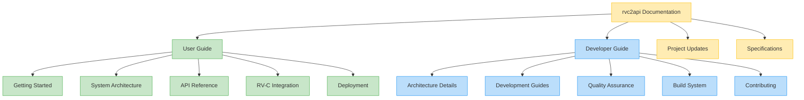

# Documentation Organization Guide

The rvc2api documentation is organized into two main sections: **User Guide** and **Developer Guide**. This structure helps different audiences find the information most relevant to their needs.

## User Guide

The **User Guide** is designed for users who want to deploy, configure, and use rvc2api. It focuses on:

- Getting started with the project
- High-level architecture overview
- API usage and integration
- RV-C protocol integration
- Deployment options

This section answers questions like:

- "How do I set up rvc2api?"
- "What APIs are available?"
- "How do I deploy this to my system?"
- "How does this integrate with my RV's systems?"

## Developer Guide

The **Developer Guide** is for contributors and developers working on extending or modifying rvc2api. It includes:

- Detailed architecture explanations
- Development workflows and practices
- Code quality standards and tools
- Build system details
- Contribution guidelines

This section answers questions like:

- "How is the code structured?"
- "What development tools should I use?"
- "How do I ensure my code meets project standards?"
- "What's the process for submitting changes?"

## Project Updates and Specifications

Additionally, the documentation includes:

- **Project Updates**: Information about recent changes to the project
- **Specifications**: Detailed design specifications for major features

## Target Audience

When adding new documentation, consider your target audience:

| If documenting...     | Add to...       | Focus on...                                 |
| --------------------- | --------------- | ------------------------------------------- |
| API usages            | User Guide      | Clear examples and use cases                |
| Deployment options    | User Guide      | Step-by-step instructions                   |
| Code architecture     | Developer Guide | Design patterns and code organization       |
| Development workflows | Developer Guide | Tools and processes                         |
| Major features        | Specifications  | Design decisions and implementation details |

## Style Guidelines

- **User Guide**: Focus on clarity, examples, and step-by-step instructions
- **Developer Guide**: Include technical details, architecture decisions, and code examples
- **All Documentation**: Use visual diagrams (with Mermaid) to illustrate complex concepts
