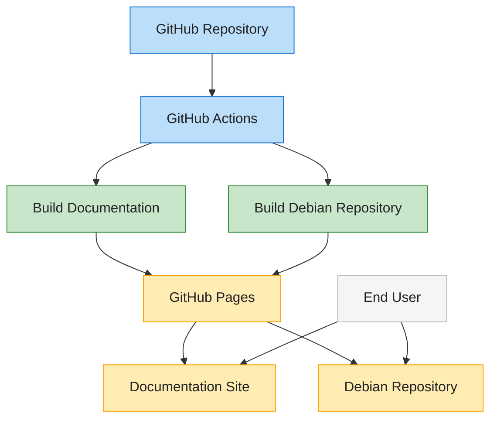

# GitHub Pages Deployment

This document explains how the rvc2api project uses GitHub Pages to host both documentation and a Debian package repository.

## Overview

GitHub Pages serves as our hosting platform for:

1. **Project Documentation**: Built with MkDocs
2. **Debian Package Repository**: For easy installation of rvc2api on Debian-based systems



## Documentation Deployment

Documentation is automatically deployed to GitHub Pages when changes are pushed to the `main` branch or the workflow is manually triggered.

### How It Works

1. GitHub Actions workflow is triggered by changes to docs or `mkdocs.yml`
2. The workflow:
   - Sets up Python and Poetry
   - Installs project dependencies
   - Builds the documentation with MkDocs
   - Deploys the built site to GitHub Pages

### Accessing Documentation

The documentation is available at:

```
https://carpenike.github.io/rvc2api/
```

## Debian Repository Deployment

The Debian repository is deployed to GitHub Pages when a new version tag is pushed.

### Repository Structure

```
https://carpenike.github.io/rvc2api/debian-repo/
├── dists/
│   └── stable/
│       ├── main/
│       │   ├── binary-amd64/
│       │   │   ├── Packages
│       │   │   └── Packages.gz
│       │   └── binary-arm64/
│       └── Release
│       └── Release.gpg
│       └── InRelease
├── pool/
│   └── main/
│       └── r/
│           └── rvc2api/
│               └── *.deb
└── KEY.gpg
```

### Using the Debian Repository

To use the repository:

1. Add the GPG key:

   ```bash
   curl -fsSL https://carpenike.github.io/rvc2api/debian-repo/KEY.gpg | sudo apt-key add -
   ```

2. Add the repository:

   ```bash
   echo "deb https://carpenike.github.io/rvc2api/debian-repo stable main" | sudo tee /etc/apt/sources.list.d/rvc2api.list
   ```

3. Update and install:

   ```bash
   sudo apt update
   sudo apt install rvc2api
   ```

### Setting Up Repository Signing

To use the repository signing capabilities:

1. Generate a GPG key using the provided script:

   ```bash
   ./scripts/generate_repo_key.sh
   ```

2. Add the generated key to your GitHub repository secrets:
   - Follow the instructions from the script output
   - Add the key as a GitHub secret named `GPG_SIGNING_KEY`

## Workflow Configuration

The GitHub Actions workflows are configured in the `.github/workflows/` directory:

- `deploy-docs.yml`: Documentation-only workflow
- `deploy-deb-repo.yml`: Debian repository workflow (triggered by version tags)
- `deploy-combined.yml`: Combined workflow for both documentation and packages

## Manual Deployment

You can manually trigger the deployment workflows from the GitHub Actions tab in your repository.
