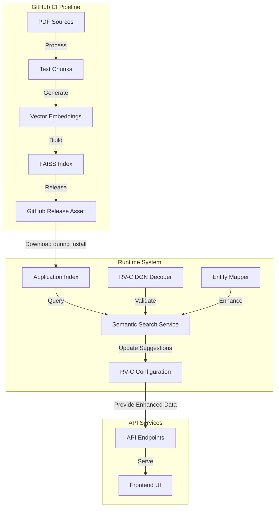
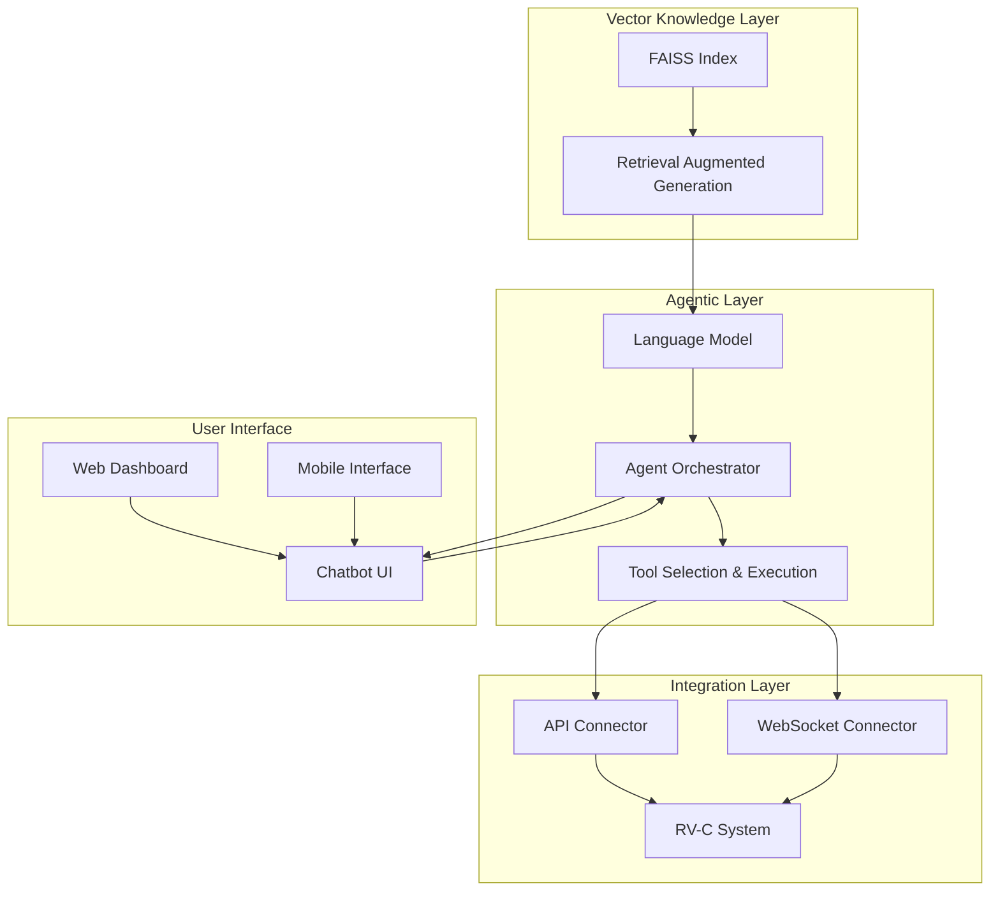

# FAISS Integration Plan for RV-C Documentation

## Overview

This document outlines the plan to incorporate FAISS vector database integration into the rvc2api project to enhance RV-C protocol interpretation, validation, and discovery. The system will leverage semantic search capabilities through vector embeddings to improve the accuracy and completeness of our RV-C decoder.

## Goals

1. **Enhance DGN Validation**: Validate that decoded DGN values match the official RV-C specification
2. **Identify Missing Mappings**: Discover gaps in our current rvc.json mappings
3. **Detect Additional Devices**: Identify devices in the RV-C specification that aren't currently mapped

## Architecture

## Implementation Plan

### 1. CI/CD Process for Index Generation

1. **PDF Document Collection**
   - Store official RV-C specification PDFs in version control
   - Add additional manufacturer PDFs for comprehensive coverage
   - Implement versioning strategy for specification updates

2. **Document Processing Pipeline**
   - Configure GitHub Actions to process PDFs when specifications change
   - Use enhanced_document_processor.py to extract and chunk text content
   - Support multiple chunking strategies for different document types
   - Generate a comprehensive JSON representation of the chunks

3. **Embedding Generation**
   - Use quality embeddings (e.g., OpenAI embedding API or local model)
   - Normalize embeddings for consistent similarity calculations
   - Consider dimensionality reduction for storage efficiency

4. **FAISS Index Creation**
   - Select appropriate FAISS index type (likely IndexIVF or IndexHNSW)
   - Configure index parameters for optimal performance/accuracy balance
   - Compress index using quantization for efficient storage
   - Package index metadata for interpretation during runtime

5. **GitHub Release Integration**
   - Automate GitHub release asset generation containing:
     - FAISS index file
     - Metadata for interpreting search results
     - Version information and source document details
   - Create semantic versioning strategy for index updates

### 2. Runtime Integration

1. **Index Loading and Management**
   - Update Nix flake to download and install the latest index release
   - Implement lazy loading of index to minimize startup impact
   - Add configuration options for index location and version control

2. **Index Query Service**
   - Create a dedicated service for handling FAISS queries
   - Implement query batching for efficient processing
   - Provide caching mechanism for frequent queries
   - Support filtering by document source and section

3. **DGN Validation Integration**
   - Extend RV-C decoder to validate DGN interpretations against the index
   - Implement confidence scoring for validations
   - Create mechanism to flag potential decoding errors
   - Log validation results for future analysis

4. **Mapping Enhancement**
   - Develop periodic scan process to identify missing mappings
   - Create pattern-based parser for interpreting search results
   - Implement suggestion mechanism for new mappings
   - Provide API to access and review suggestions

5. **Device Discovery**
   - Create detection process for undocumented devices
   - Build parser for device capability extraction
   - Implement confidence scoring for device suggestions
   - Provide feedback mechanism to improve detection accuracy

### 3. Result Parser Implementation

1. **Semantic Parsing Strategy**
   - Implement pattern recognition for different document sections
   - Create specialized parsers for:
     - DGN specifications (data format, scaling, units)
     - Device capabilities and characteristics
     - Protocol requirements and constraints

2. **Structured Information Extraction**
   - Extract key information from embedding search results:
     - Data field specifications (bit positions, scaling factors)
     - Valid value ranges and enumerations
     - Engineering units and conversion factors
     - Relationships between DGNs and devices

3. **Confidence Scoring**
   - Implement scoring algorithm for result reliability
   - Consider context, search score, and result consistency
   - Apply different thresholds for different use cases

4. **Integration with Existing Models**
   - Connect parser results with Pydantic models
   - Ensure type safety through validation
   - Create adapters for different result formats

### 4. Frontend Integration

1. **Configuration Interface**
   - Add UI for viewing and managing semantic search results
   - Implement suggestion review and acceptance workflow
   - Provide visualization of missing mappings and potential enhancements

2. **Developer Tools**
   - Create debugging tools for viewing raw search results
   - Implement testing interface for manual queries
   - Add visualization for understanding embedding relationships

3. **Documentation Enhancement**
   - Automatically generate enhanced documentation using index data
   - Link API documentation to relevant specification sections
   - Provide searchable specification references

## Milestones and Timeline

1. **Foundation (Sprint 1)**
   - Set up GitHub Actions workflow for processing PDFs
   - Implement basic index generation and release process
   - Create initial index loading mechanism in the application

2. **Core Integration (Sprint 2)**
   - Implement FAISS query service with basic parsing
   - Create DGN validation integration
   - Develop initial mapping enhancement features

3. **Advanced Features (Sprint 3)**
   - Implement device discovery capabilities
   - Enhance parser with confidence scoring
   - Add frontend tools for managing results

4. **Refinement (Sprint 4)**
   - Optimize performance and resource usage
   - Enhance result quality through parser improvements
   - Complete frontend integration

## Technical Considerations

### Performance Optimization

- **Index Compression**: Use dimensionality reduction and quantization
- **Query Batching**: Batch related queries for efficiency
- **Caching**: Implement result caching for frequent lookups
- **Memory Management**: Use memory mapping for large indices

### Reliability

- **Versioned Indices**: Track index versions with source documents
- **Confidence Scoring**: Implement robust scoring for result reliability
- **Fallback Mechanisms**: Provide graceful degradation if index is unavailable
- **Validation**: Compare parser results against known-good examples

### Extensibility

- **Plugin Architecture**: Allow custom parsers for different document types
- **Configuration Options**: Make behavior configurable for different use cases
- **API Design**: Create clean interfaces for future enhancements
- **Documentation**: Provide detailed documentation for customization

## Future Enhancements

- **Interactive Learning**: Implement feedback loop to improve parser accuracy
- **Multi-Index Support**: Support multiple specialized indices for different purposes
- **Natural Language Queries**: Allow querying the index using natural language
- **Cross-Reference Analysis**: Identify relationships between different RV-C components
- **Anomaly Detection**: Use embeddings to identify unusual device behavior

## Agentic Interface and Chatbot Integration

Building on the FAISS vector database foundation, a future iteration could implement an agentic interface with conversational capabilities. This would transform the system from a passive validation tool to an interactive assistant that can help users understand and interact with RV-C systems.

### Architecture for Agentic Integration

### Core Components for Agentic Interface

1. **Retrieval Augmented Generation (RAG) System**
   - Build on the FAISS vector store to retrieve relevant context
   - Implement prompt engineering for specific RV-C knowledge extraction
   - Create templated responses for common operations and queries

2. **Language Model Integration**
   - Connect with LLM service (e.g., OpenAI API, local Llama model)
   - Design specialized prompts for RV-C domain understanding
   - Implement context window management for complex conversations

3. **Agent Orchestrator**
   - Develop intent recognition for user queries
   - Create task planning and decomposition capabilities
   - Implement conversation history tracking and context management
   - Build error recovery and clarification mechanisms

4. **Tool Selection and Execution Framework**
   - Create tool definitions for common RV-C operations
   - Implement parameter extraction from natural language
   - Build validation layer for safety and security
   - Design feedback mechanisms for tool execution outcomes

5. **UI/UX Components**
   - Design conversational interface (web-based or embedded)
   - Create visualization components for system state
   - Implement multi-modal interaction (text, voice, graphical)
   - Build accessibility features for diverse users

### Use Cases for Agentic Interface

1. **Conversational System Diagnostics**
   - "What's the status of my water heater?"
   - "Why isn't my bedroom light turning on?"
   - "Show me power usage for the last 24 hours"

2. **Natural Language Control**
   - "Turn on the living room lights at 50% brightness"
   - "Set the thermostat to 72 degrees when we're home"
   - "Start generator maintenance mode"

3. **Interactive Documentation**
   - "Explain how the tank level sensors work"
   - "What DGNs are related to the climate control system?"
   - "Show me the protocol for battery charging"

4. **System Configuration**
   - "Set up a new light fixture in the bedroom"
   - "Configure the entertainment system to turn on with a single command"
   - "Create a power-saving mode for overnight"

### Implementation Considerations

1. **Security and Safety**
   - Implement multi-level authorization for system control
   - Create validation guardrails for potentially harmful actions
   - Design confirmation workflows for critical operations
   - Build audit logging for all agent actions

2. **Performance Optimization**
   - Use stream processing for real-time responses
   - Implement local embedding and inference where possible
   - Create lightweight response modes for bandwidth-constrained environments

3. **Integration Requirements**
   - Design API abstraction layer for system operations
   - Implement WebSocket handlers for real-time updates
   - Build adapters for different RV-C implementations

4. **User Experience**
   - Create conversational patterns specific to RV systems
   - Design feedback mechanisms for successful operations
   - Implement progressive disclosure of system capabilities
   - Build user onboarding and help systems

### Future Research Areas

- **Multimodal Understanding**: Processing images and diagrams of RV systems alongside text queries
- **Predictive Maintenance**: Using historical data to predict and prevent system failures
- **Personalization**: Learning user preferences and adapting responses accordingly
- **Offline Operation**: Enabling core functionality without internet connectivity
- **Multi-agent Collaboration**: Specialized agents for different subsystems working together

## Dependencies and Requirements

- **OpenAI API Access**: For generating high-quality embeddings (or alternative)
- **GitHub Actions Capacity**: Sufficient resources for PDF processing
- **Storage Requirements**: Space for index storage (~50-100MB estimated)
- **Memory Requirements**: RAM for index loading and query processing

## Risks and Mitigations

| Risk | Impact | Mitigation |
|------|--------|------------|
| Embedding quality insufficient for accurate matches | High | Test with multiple embedding models; implement confidence thresholds |
| PDF processing fails to extract critical information | Medium | Validate extraction results; manual review process |
| Index size becomes too large for distribution | Medium | Implement compression; consider serving smaller specialized indices |
| Parser misinterprets specification details | High | Create comprehensive validation tests; implement confidence scoring |
| Runtime performance impact | Medium | Profile and optimize; implement caching; consider background processing |

## GitHub Issue Tracking

To implement this plan, we will track progress through a set of GitHub issues organized as follows:

### Epic: FAISS Integration for RV-C Documentation

1. **Infrastructure Setup**
   - Issue: Set up PDF document repository structure
   - Issue: Create GitHub Action for PDF processing and embedding generation
   - Issue: Implement FAISS index creation and release process
   - Issue: Update Nix flake for index distribution

2. **Core System Development**
   - Issue: Create semantic search service architecture
   - Issue: Implement index loading and query functionality
   - Issue: Develop result parser framework
   - Issue: Create parsers for DGN specifications

3. **Integration Components**
   - Issue: Connect DGN decoder with semantic search for validation
   - Issue: Implement mapping enhancement detection
   - Issue: Create device discovery process
   - Issue: Add API endpoints for semantic search features

4. **Frontend and Developer Tools**
   - Issue: Design UI for search result management
   - Issue: Create developer debugging tools
   - Issue: Implement result visualization
   - Issue: Add documentation integration

5. **Testing and Validation**
   - Issue: Create comprehensive test suite for parsers
   - Issue: Develop validation framework for embedding quality
   - Issue: Implement performance benchmarks
   - Issue: Design integration tests for the complete system

6. **Documentation**
   - Issue: Document CI/CD process for index generation
   - Issue: Create integration guide for developers
   - Issue: Write admin documentation for configuration options
   - Issue: Prepare user guide for frontend features

7. **Future: Agentic Interface Research**
   - Issue: Research language models suitable for RV-C domain
   - Issue: Design agent architecture prototype
   - Issue: Evaluate RAG performance with RV-C documentation
   - Issue: Create proof-of-concept for conversational interface

## Conclusion

This FAISS integration plan provides a structured approach to incorporating vector search capabilities into the rvc2api project. By leveraging semantic search, we can significantly enhance the accuracy and completeness of our RV-C decoder, ensuring better interoperability with diverse RV-C implementations. The future possibilities for agentic interfaces could transform how users interact with RV systems, making complex protocol details accessible through natural language conversation.
