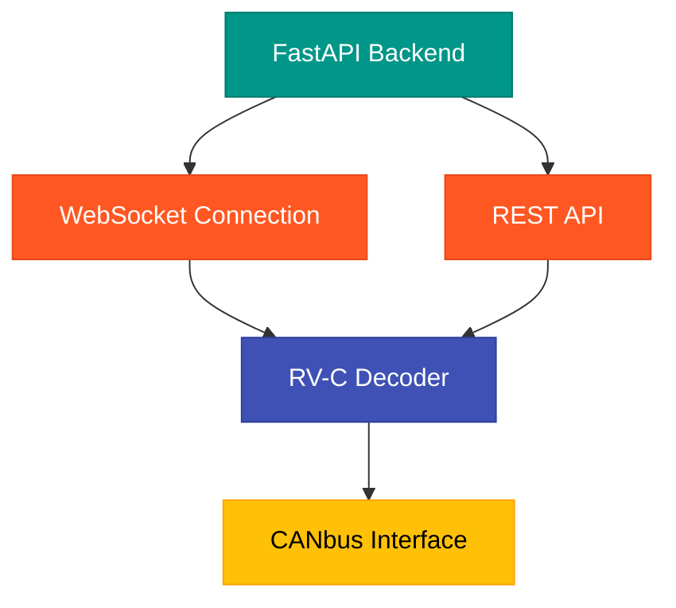
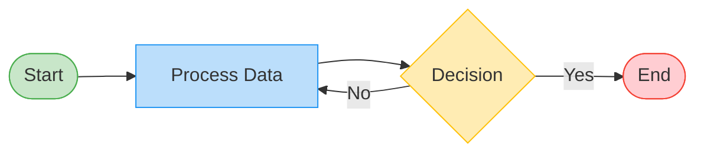
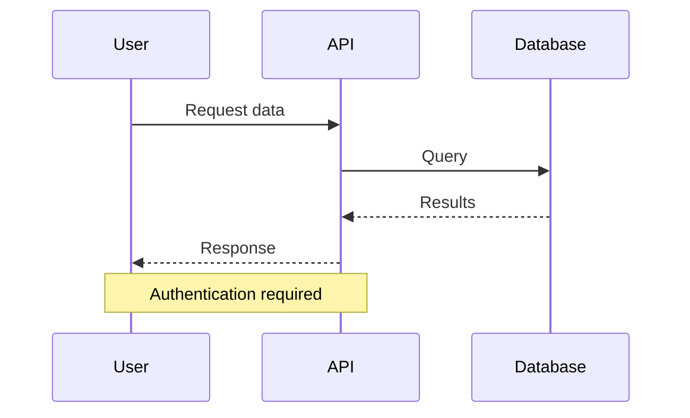

# Testing Mermaid Diagrams

This file is for testing that mermaid diagrams render correctly with the updated YAML configuration.

## Sample Diagram

Here's a diagram showing the main components of our application:

## Simple Flowchart

A simple process flowchart:

## Sequence Diagram

A sample interaction sequence:

This should render as proper diagrams if the configuration is correct.
